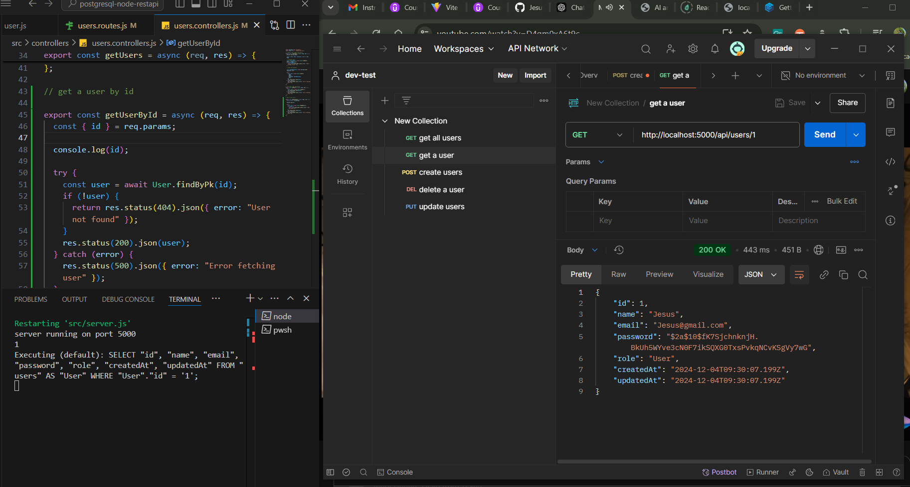
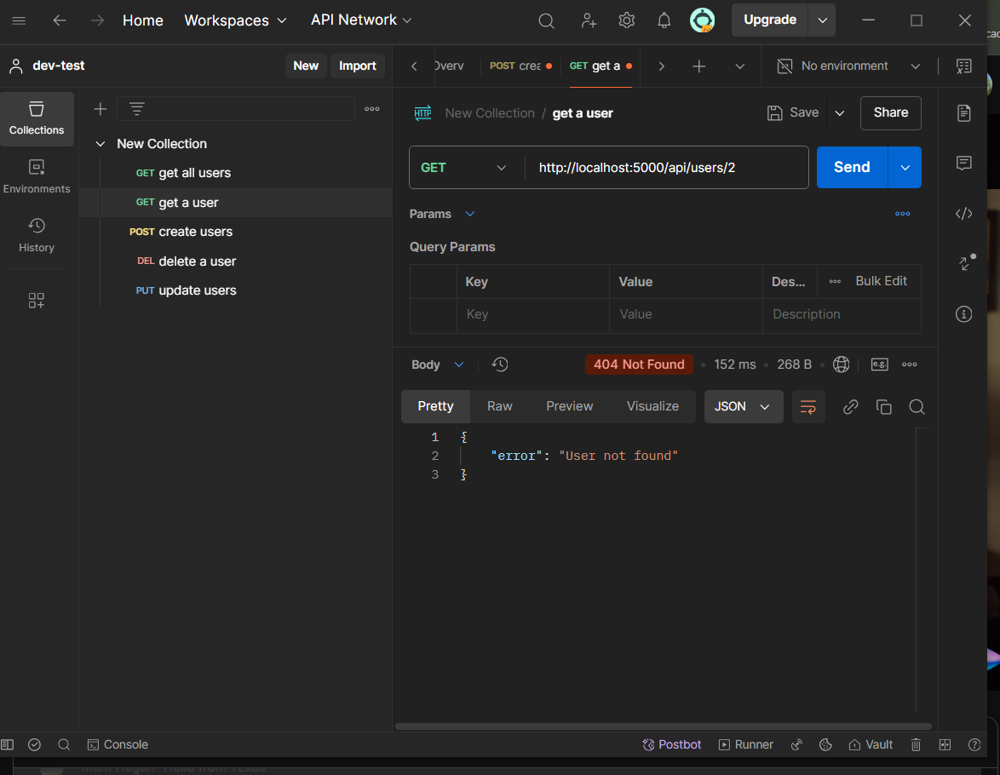
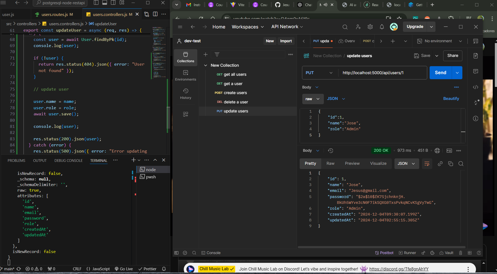
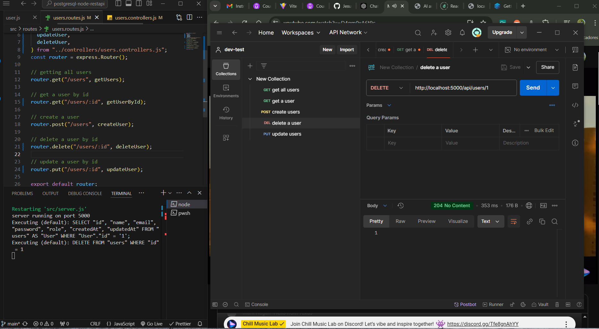
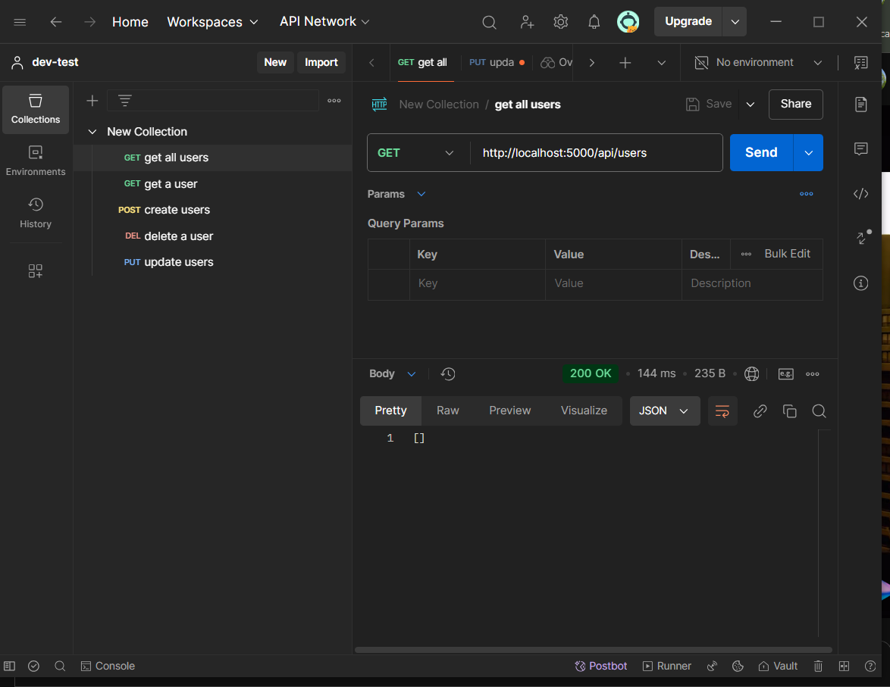

# postgresql-node-restapi

# screenshot links:

# creating a user route POST : http://localhost:5000/api/users

# validate email uniquenes:

# getting all users route GET : http://localhost:5000/api/users

# getting a user by id route GET: http://localhost:5000/api/users/1

# user not found by id: http://localhost:5000/api/users/2

# updating a user name and role by id: route PUT http://localhost:5000/api/users/1

# deleting a user by id route DELETE: http://localhost:5000/api/users/1

